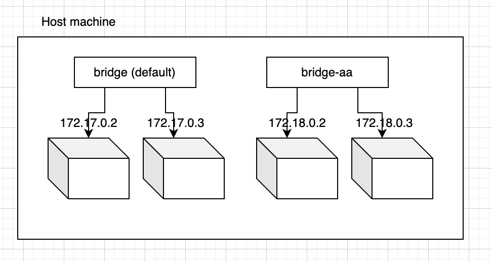
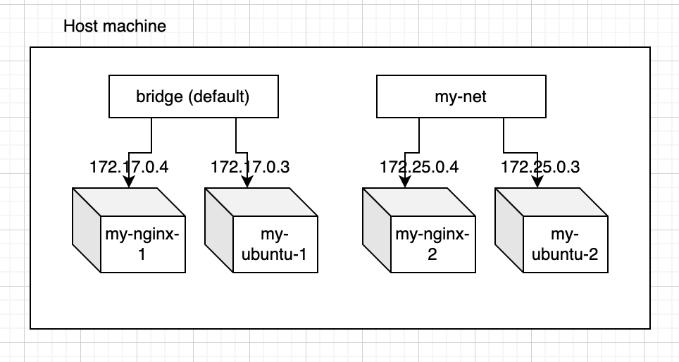

# How to use docker command

docker container run hello-world

docker image pull {image name}
  [old] docker pull
docker image ls
  [old] docker images
docker image rm {image name, image ID}
  [old] docker rmi

docker container run {image name}
  [old] docker run
docker container ls
  [old] docker ps
docker container ls -a

docker container stop {CONTAINER ID, NAMES}
docker container restart {CONTAINER ID, NAMES}
docker container logs {CONTAINER ID, NAMES}

docker container rm {CONTAINER ID, NAMES}
  [old] docker rm

## Execute Dockerfile
cd {work dir}
docker image build .
docker image build -t ubuntu-20240818:v1 .

docker container run -it ubuntu:20.04
docker container run -it {image id}

## 
FROM 
RUN {command, better to use -y option if you want to install something; always answer yes}
COPY
CMD <- Set default command, it runs only once

## ARG
docker image build --build-arg message="Hello Message" .

### Deference of ARG and ENV
ARG: 
- When creating image
- Temporarily effective
ENV:
- When creating image
- When executing container
- Effective both

## About size of image layer
Better to use less number of layers, The difference between the changes in the IMAGE is saved as a layer.

## Multi-stage build
--from=
- To manage 1 Dockerfile using --from and FROM command
docker image build --target development .

## Persistence of container layer data
- volume
docker volume create {volume name}
docker volume ls
docker volume inspect {volume name}
docker volume rm {volume name}

docker container run -v {volume name}:{absolute path} {image}
docker container run --mount src={volume name},dst={absolute path} {image}

docker volume create volume-20240916
docker container run -it -v volume-20240916:/app1 --name container-1 ubuntu:20.04
docker container run -it -v volume-20240916:/app2 --name container-2 ubuntu:20.04
  /app1 and /app2: Commonly mounted areas
  can be sync in real time

# Docker network
## Connect to container
docker container run -p {port on host machine}:{port on container} {image}
docker container run -p 3000:80 nginx
curl http://localhost:3000/

## bridge network
docker network ls
docker network inspect bridge

The default network is bridge.
If the container is not tied to a specific network, it belongs to the default bridge network.

### Confirmation
docker network inspect bridge
docker container run -itd --rm --name test-nginx-1 nginx
docker container ls
docker network inspect bridge

docker network create my-net
docker container run -itd --rm --name test-nginx-2 --network my-net nginx
docker container ls
docker network inspect bridge
  no change
docker network inspect my-net
  confirm new container is on my-net

### Confirmation 
cd {path}/container_sample
docker image build -t my-ubuntu .
docker container run -itd --name my-ubuntu-1 my-ubuntu
docker container ls
docker network ls
docker container run -itd --name my-ubuntu-2 --network my-net my-ubuntu
docker container ls

docker container run -d --name my-nginx-1 nginx
docker container run -d --name my-nginx-2 --network my-net nginx
docker network inspect bridge
docker network inspect my-net

docker container exec -it my-ubuntu-1 bash
curl http://172.17.0.4
  send request my-ubuntu-1 to my-nginx-1, success
curl http://172.25.0.4
  send request my-ubuntu-1 to my-nginx-2 in my-net, failed

docker container exec -it my-ubuntu-2 bash
curl http://172.25.0.4
curl http://172.17.0.4

## name resolution (container name -> IP)
Only custom networks can use name resolution.

docker container exec -it my-ubuntu-2 bash
curl http://my-nginx-2
  success
curl http://my-nginx-1
  could not resolve host

docker container exec -it my-ubuntu-1 bash
curl http://my-nginx-1
  could not resolve host, even the containers belong same network
curl http://my-nginx-2
  could not resolve host

# Docker compose
## Confirmation
1. Create sample app
Need to set <finalName>api</finalName> in pom.xml
Ref: https://qiita.com/takuch/items/e5ab6e51b2be0743abc8#spring-boot%E3%81%AEdockerfile%E3%82%92%E4%BD%9C%E6%88%90
2. Put Dockerfile under the app dir
cd {path}/compose_sample/webapi/api
docker image build -t api-img .
docker container run -p 8080:8080 --rm api-img
3. Put docker-compose.yml under the /webapp, need to involve all cantainer apps
docker compose up

docker compose up db
docker compose exec db bash
psql -U {User}
\l
  confirm there is appdb
\c appdb
\dt
  confirm there is greetings table

docker compose logs

4. Rebuild and confirmation
docker compose up --build
curl 'http://localhost:8080/api/hello?lang=ja'
  Should be returned "こんにちは"

# Unix commands
mkfile xxxm {filename} : Make file with xxx[MB]